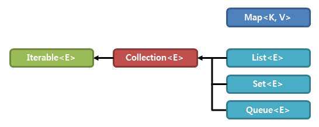

## 컬렉션 (Collection)
컬렉션 프레임워크(Collection Framework)란 다수의 데이터를 쉽고 효과적으로 처리할 수 있는 표준화된 방법을 제공하는 클래스의 집합을 의미한다. 즉, 데이터를 저장하는 자료 구조와 데이터를 처리하는 알고리즘을 구조화하여 클래스로 구현해 놓은 것이다.
이러한 컬렉션 프레임워크는 java.util 패키지에 포함되며 자바의 인터페이스(Interface)를 사용하여 구현된다.

### 컬렉션의 장점
1. 크기 제약이 없다.
2. 추가, 삭제, 검색, 정렬 등의 기능이 내장되어 있음. (자료 구조적 알고리즘 구현 필요 없음)
3. 여러 데이터 타입을 저장할 수 있다. (단, 객체만 저장할 수 있으므로 기본 자료형은 Wrapper Class 로 변환해 저장)

### 컬렉션 프레임워크 주요 인터페이스

* Collection 인터페이스 상속
	1. List
	2. Set
* Map 인터페이스
	3. Map

인터페이스|설명|구현 클래스
:---:|---|---
List<E>|순서가 있는 데이터의 집합. 데이터의 중복을 허용.|Vector, **ArrayList**, **LinkedList**, Stack, Queue
Set<E>|순서가 없는 데이터의 집합 데이터의 중복을 허용하지 않음.|**HashSet**, TreeSet
Map<K, V>|키와 값의 한 쌍으로 이루어지는 데이터의 집합, 순서가 없음 키는 중복을 허용하지 않으나 값은 중복될 수 있음|**HashMap**, TreeMap, Hashtable, Properties

