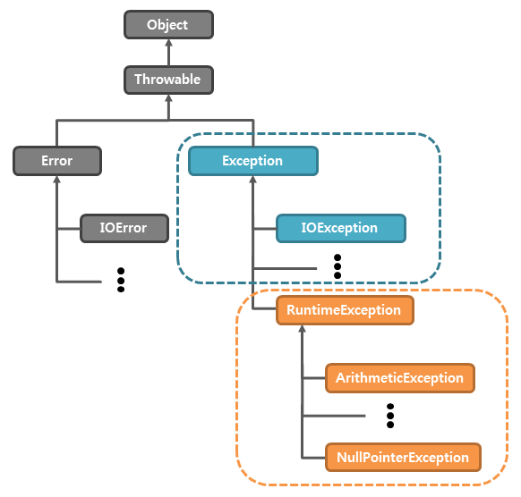

## 오류(error)와 예외(exception)
* 오류(error): 시스템 레벨에서 프로그램에 심각한 문제를 야기하여 실행 중인 프로그램을 종료시킴. 이러한 오류는 개발자가 미리 예측하여 처리할 수 없는 것이 대부분이므로, 오류에 대한 처리는 할 수 없음.
* 예외(exception): 오류와 마찬가지로 실행 중인 프로그램을 비정상적으로 종료시키지만, 발생할 수 있는 상황을 미리 예측하여 처리할 수 있음. 

우리는 흔히 오류와 예외를 구분하지 않고 모두 오류라고 부르지만, 엄밀히 말해 시스템 단의 오류가 아닌 프로그램의 결과로 발생하는 모든 오류는 예외라고 부르는 것이 바람직하다.

### 예외 처리(exception handling)
#### 문법
```java
try { 예외를 처리하길 원하는 실행 코드; }
catch(e1) { e1 예외가 발생할 경우 실행될 코드; }
catch(e2) { e2 예외가 발생할 경우 실행될 코드; }
finally { 예외 발생 여부와 상관없이 무조건 실행될 코드; }
```
※ 다른 제어문과는 다르게 중괄호({})를 생략할 수 없음.

### Exception 클래스
자바에서 모든 예외의 조상 클래스가 되는 Exception 클래스는 다음과 같이 구분한다.

1. RuntimeException 클래스
2. 그 외의 Exception 클래스의 자식 클래스



#### UnCheckedException
RuntimeException 클래스를 상속받는 자식 클래스들은 주로 치명적인 예외상황을 발생시키지 않는 예외들로 구성. 사용자 혹은 프로그래머의 실수로 인해 발생하고, 코드를 수정해 예외를 발생시키지 않을 수 있기 때문에 try / catch문을 사용하기 보다는 프로그램을 작성하면서 예외가 발생하지 않도록 주의를 기울이는 것이 좋다.

#### CheckedException
자바 컴파일러는 RuntimeException 클래스 이외의 Exception 클래스의 자식 클래스에 속하는 예외가 발생할 가능성이 있는 구문에는 반드시 예외를 처리하도록 강제하고 있다.
만약 이러한 예외가 발생할 가능성이 있는 구문을 예외 처리하지 않았을 때는 컴파일 시 오류를 발생시킨다.

```java
public void example6() {
	throw new RuntimeException(); // 예외 처리 구문이 강제되지 않아서 IDE 에서 밑줄을 표시하지 않음.
	throw new IOException(); // CheckedException
	// 에러가 발생할 가능성이 있기 때문에 에러 상황에 대한 조치를 반드시 작성해야 한다. IDE 에서 밑줄을 표시함.
```

#### Exception 클래스의 상속 관계
발생하는 예외들도 예외 클래스를 이용해 생성된 예외 객체들이기 때문에 catch 문을 여러 개 작성하는 경우 상속 관계를 고려해야 한다.
마찬가지로 다형성이 적용되기 때문에 부모 타입 예외 참조변수를 작성하면 자식 예외 객체를 모두 참조할 수 있다.

```java
try {
    System.out.write(list);
} catch (Exception e) {
    e.printStackTrace();
} catch (IOException e) { // 먼저 실행되는 catch에서 상위의 예외를 처리하기 때문에 이 부분은 실행되지 못함.
    e.printStackTrace();
}
```

위의 예제에서 IOException이 발생하면, 자바는 첫 번째 catch 블록부터 순서대로 예외를 처리할 수 있는 검사한다.
그런데, IOException은 Exception의 자식 클래스이므로 첫 번째 catch 블록에서 IOException이 먼저 처리된다.
만일, IOException만을 따로 처리하고자 한다면, 아래 예제처럼 catch 블록의 순서를 바꿔야 한다.

```java
try {
    System.out.write(list);
} catch (IOException e) {
    e.printStackTrace();
} catch (Exception e) {
    e.printStackTrace();
}
```

예외 처리를 위해서는 예외 클래스의 상속 관계를 살펴 설계할 필요가 있다.

### 예외 발생시키기
자바에서는 throw 키워드를 사용하여 강제로 예외를 발생시킬 수 있다.

```java
Exception e = new Exception("오류메시지");
throw e;
```

### 예외 회피하기
메소드 선언부에 throws 키워드를 사용하여 해당 메소드를 사용할 때 발생할 수 있는 예외를 미리 명시할 수 있다.
이렇게 하면 해당 메소드를 사용할 때 발생할 수 있는 예외를 사용자가 충분히 인지할 수 있으며, 그에 대한 처리까지도 강제할 수 있다.

#### 호출된 메소드에서 발생한 예외 처리하기
```java
public class Exception03 {
    static void handlingException() { // ②
        try {
            throw new Exception(); // ③
        } catch (Exception e) { // ④
            System.out.println("호출된 메소드에서 예외가 처리됨!");
        }
    }

    public static void main(String[] args) {
        try {
            handlingException(); // ①
        } catch (Exception e) {
            System.out.println("main() 메소드에서 예외가 처리됨!");
        }
    }
}
```
이때 호출된 메소드의 try/catch 문을 생략하면 컴파일 오류가 발생. 또한, 이 메소드를 호출한 main() 메소드는 호출된 메소드에서 예외가 발생한 사실을 알 수 없음.


#### 호출된 메소드에서 발생한 예외를 호출한 메소드로 넘겨 처리하기
```java
public class Exception04 {
    static void handlingException() throws Exception { throw new Exception(); } // ②
    public static void main(String[] args) {
        try {
            handlingException(); // ①
        } catch (Exception e) { // ③
            System.out.println("main() 메소드에서 예외가 처리됨!"); // ④
        }
    }
}
```

### 사용자 정의 예외 클래스
자바에서는 Exception 클래스를 상속받아 새로운 예외 클래스를 정의하여 사용할 수 있다.
생성자 뿐만 아니라 필드 및 메소드도 원하는 만큼 추가할 수 있다.

```java
class MyException extends RuntimeException {
    MyException(String errMsg) {
        super(errMsg);
    }
}
```

### Throwable 클래스
Throwable 클래스는 모든 예외의 조상이 되는 Exception 클래스와 모든 오류의 조상이 되는 Error 클래스의 부모 클래스.

Throwable 타입과 이 클래스를 상속받은 서브 타입만이 자바 가상 머신(JVM)이나 throw 키워드에 의해 던져질 수 있다.

|메소드|설명|
|---|---|
|String getMessage()|해당 throwable 객체에 대한 자세한 내용을 문자열로 반환함.|
|void printStackTrace()|해당 throwable 객체와 표준 오류 스트림(standard error stream)에서 해당 객체의 스택 트레이스(stack trace)를 출력함.|
|String toString()|해당 throwable 객체에 대한 간략한 내용을 문자열로 반환함.|

```java
try {
    System.out.println(5 / 0);
} catch (ArithmeticException e) {
    System.out.println("현재 발생한 예외 정보 : " + e.printStackTrace());
}
```

### 자주 사용되는 예외 클래스
|클래스|설명|
|---|---|
|ClassCastException|수행할 수 없는 타입 변환이 진행될 경우|
| ArrayIndexOutOfBoundsException|배열에 잘못된 인덱스를 사용하여 접근할 경우|
| NullPointerException|	null 객체의 인스턴스 메소드를 호출하는 등의 경우|
| ArithmeticException|산술 연산에서 정수를 0으로 나누는 등 연산을 수행할 수 없는 경우|