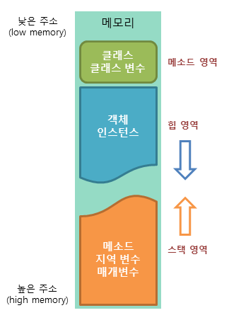

## 용어 정리
다른 언어와 차이가 있거나 참고해야할 부분을 중심적으로 용어를 정리.

### JVM?
자바 가상 머신(Java Virtual Machine)의 약자.
#### JVM의 특징
- 스택 기반의 가상 머신
- 단일 상속 형태의 객체 지향 프로그래밍을 가상 머신 수준에서 구현
- 가비지 컬렉션 사용
- 모든 기본 타입의 정의를 명확하게 하도록 강제함.

#### JVM의 메모리 구조


* 메소드(method) 영역
	- 자바 프로그램에서 사용되는 클래스에 대한 정보와 함께 클래스 변수(static variable)가 저장되는 영역.
	- JVM은 자바 프로그램에서 특정 클래스가 사용되면 해당 클래스의 클래스 파일(*.class)을 읽어들여, 해당 클래스에 대한 정보를 메소드 영역에 저장함.
* 힙(heap) 영역
	- 자바 프로그램에서 사용되는 모든 인스턴스 변수가 저장되는 영역.
	- JVM은 자바 프로그램에서 new 키워드를 사용하여 인스턴스가 생성되면, 해당 인스턴스의 정보를 힙 영역에 저장함.
	- 힙 영역은 메모리의 낮은 주소에서 높은 주소의 방향으로 할당.
* 스택(stack) 영역
	- 자바 프로그램에서 메소드가 호출될 때 메소드의 스택 프레임이 저장되는 영역.
	- JVM은 자바 프로그램에서 메소드가 호출되면 메소드의 호출과 관계되는 지역 변수와 매개 변수를 스택 영역에 저장.
	- 이렇게 스택 영역은 메소드의 호출과 함께 할당되며, 메소드의 호출이 완료되면 소멸함.
	- 이 스택 영역에 저장되는 메소드의 호출 정보를 **스택 프레임**이라고 함.
    	- 스택 영역은 후입선출(LIFO) 방식에 따라 동작하므로 가장 늦게 저장된 데이터가 가장 먼저 인출됨. 
    	- 스택 영역은 메모리의 높은 주소에서 낮은 주소의 방향으로 할당.

### 변수(Variable)
데이터를 저장하기 위해 프로그램에 의해 이름을 할당받은 메모리 공간을 의미. 즉, 변수란 데이터를 저장할 수 있는 메모리 공간을 의미하고, 이렇게 저장된 값을 변경될 수 있음.

1. 기본형(Primitive Type) 변수
    - 기본형 변수는 _실제 연산_에 사용되는 변수
	- 정수형 : byte, short, int, long
	- 실수형 : float, double
	- 문자형 : char
	- 논리형 : boolean
2. 참조형(Reference Type) 변수
	- 기본형을 제외한 모든 자료를 가리키고 있는 변수. 변수가 가리키는 것은 실제 값이 아닌 그 값이 저장된 메모리의 위치.
	- 주로 배열이나 객체 등을 가리키는데에 사용된다. 
	
#### 상수(Constant)
상수는 변수와 마찬가지로 이름을 가지고 있는 메모리 공간으로 이러한 상수는 선언과 동시에 반드시 초기화해야 함.
(C++과 Javascript에서는 const 키워드를 사용하여 상수를 선언하지만, 자바에서는 final 키워드를 사용하여 선언)

### 형변환(Casting, Type Conversion)
하나의 자료형을 다른 자료형으로 바꾸는 것.
(boolean형을 제외한 나머지 타입 간의 변환은 자유롭게 수행 가능)

#### 타입 변환의 종류
1. 묵시적 타입 변환(자동 타입 변환)
	- 대입 연산이나 산순 연산에서 컴파일러에 의해 자동으로 수행되는 타입 변환
	- 데이터 손실이 일어나지 않거나 최소화되는 방향으로 묵시적 타입 변환을 진행함.
	- 또한, 자바에서는 데이터의 손실이 발생하는 대입 연산은 허용되지 않음.
2. 명시적 타입 변환(강제 타입 변환)
	- 사용자가 의도적으로 타입캐스트 연산자 ()를 사용해 강제적으로 수행하는 타입 변환.

### 다차원 배열
2차원 이상의 배열을 의미하며, 배열 요소로 또 다른 배열을 가지는 배열을 의미.
자바에서는 2차원 배열을 다음과 같은 문법으로 선언할 수 있다.

```java
String[][] str1 = new String[3];
String str2[][] = new String[3];
String[] str3[] = new String[] // 가변 배열 선언방법;
```

### 객체 지향 프로그래밍
실세계에 _존재하고 인지하고 있는 객체(Object)_를 소프트웨어의 세계에서 표현하기 위해 객체의 _핵심적인 개념 또는 기능만을 추출하는 추상화(abstraction)_를 통해 모델링하려는 프로그래밍 패러다임을 말한다. 다시 말해, 우리가 주변의 실세계에서 사물을 인지하는 방식을 프로그래밍에 접목하려는 사상을 의미한다.

### 클래스(Class)
객체를 정의하는 틀, 또는 설계도와 같은 의미로 사용됨.

#### 클래스의 구성 요소
1. 필드(field) : 객체의 상태를 나타냄 (= 클래스에 포함된 변수)
2. 메소드(method) : 객체의 행동을 나타냄 (Javascript 등의 function과 유사)
3. 생성자(constructor) : 메소드의 일종으로 인스턴스의 생성과 동시에 원하는 값으로 초기화할 수 있는 기능을 함. 생성자의 이름은 클래스와 이름이 같아야 함.

### 인스턴스(Instance)
클래스를 사용하기 위해서는 우선 해당 클래스 타입의 객체를 선언해야 함.
이렇게 클래스로 부터 객체를 선언하는 과정을 클래스의 인스턴스화 라고 함.
즉, 이렇게 선언된 해당 클래스 타입의 객체를 인스턴스라고 하며 메모리에 할당된 객체를 의미함. (= 클래스로부터 생성된 객체)

### 메소드
어떠한 특정 작업을 수행하기 위한 명령문의 집합.

#### 메소드 시그니처(method signature)
메소드 선언부에 명시되는 매개변수의 리스트.
두 메소드의 매개변의 개수와 타입, 그 순서까지 같다면, 이 두 메소드의 시그니처는 같다고 할 수 있음.

#### 오버로딩(overloading)
자바에서는 하나의 클래스에 같은 이름의 메소드를 둘 이상 정의할 수 없지만, 메소드 오버로딩을 이용하면 같은 이름의 메소드를 중복해 정의할 수 있음.
매개변수의 개수나 타입을 다르게 하여 같은 이름의 또 다른 메소드를 작성할 수 있음.

* 장점: 
	- 메소드에 사용되는 이름을 절약할 수 있음
	- 메소드를 호출할 때에 전달해야 할 매개변수의 타입이나 개수에 대해 크게 신경쓰지 않고 호출할 수 있게 됨.
* 조건: 
	- 메소드의 이름이 같아야 함.
	- 메소드의 시그니처, 즉 매개변수의 개수 또는 타입이 달라야 함.
* 메소드 오버로딩의 예: print(), toString() 메소드

### 제어자(modifier)
클래스와 클래스 멤버의 선언 시 사용하여 부가적인 의미를 부여하는 키워드를 의미.
자바에서 제어자는 접근 제어자(access modifier)와 기타 제어자로 구분.
기타 제어자는 경우에 따라 여러 개를 함께 사용할 수도 있지만, 접근 제어자를 두 개 이상 같이 사용할 수는 없음.
이러한 접근 제어자와 기타 제어자는 조합에 따라 함께 사용할 수 있다.

#### 접근 제어자
| 접근 제어자 | 같은 클래스의 멤버 | 같은 패키지의 멤버 | 자식 클래스의 멤버 | 그 외의 영역 |
| --- | --- | --- | --- | --- |
| public | O | O | O | O |
| protected | O | O | O | X |
| default | O | O | X | X |
| private | O | X | X | X |

#### final 제어자
'변경할 수 없다'는 의미로 사용되는 제어자.
필드나 변수에 사용하면 이는 상수를 의미
클래스에 사용하면 해당 클래스는 상속받을 수 없는 상태가 됨.
메소드에 사용하면 해당 메소드는 오버라이딩을 통한 재정의를 할 수 없게 됨.

#### static 제어자
'공통적인'이라는 의미로 사용되는 제어자.
변수에 사용하면 해당 변수는 클래스 변수가 됨.
메소드에 사용하면 클래스 메소드가 됨.

1. 프로그램 시작시 최초에 단 한 번만 생성되고 초기화됨.
2. 인스턴스를 생성하지 않고도 바로 사용할 수 있게 됨.
3. 해당 클래스의 모든 인스턴스가 공유함.
4. static 제어자를 사용할 수 있는 대상: 메소드, 필드, 초기화 블록

#### abstract 제어자
'추상적인'이라는 의미로 사용되는 제어자.
선언부만 있고 구현부가 없는 메소드를 추상 메소드라 함.
또한, 하나 이상의 추상 메소드가 포함하고 있는 추상 클래스도 반드시 abstract 제어자를 붙여야 함.
클래스와 메소드에 사용 가능.

### 필드의 구분
1. 클래스 변수(static variable)
2. 인스턴스 변수(instance variable)
3. 지역 변수(local variable)

```java
class Car {
    static int modelOutput; // 클래스 변수
    String modelName;       // 인스턴스 변수
    void method() {
        int something = 10; // 지역 변수
    }
}
```
클래스 변수와 인스턴스 변수는 초기화를 하지 않아도 변수의 타입에 맞게 자동으로 초기화
하지만 지역 변수는 사용하기 전에 초기화하지 않으면, 자바 컴파일러가 오류를 발생시킨다.
자바에서 클래스 변수와 인스턴스 변수는 falsy한 타입으로 기본값이 지정됨.

### 메소드의 구분
1. 클래스 메소드(static method)
2. 인스턴스 메소드(instance method)

```java
class Car {
    boolean door;                       // 인스턴스 변수
    void openDoor() {                   // 인스턴스 메소드
        door = true;
    }
    static void toggleDoor(boolean d) { // 클래스 메소드
        return !d;
    }
}
```

### 상속(inheritance)
기존의 클래스에 기능을 추가하거나 재정의하여 새로운 클래스를 정의하는 것을 의미.
이러한 상속은 캡슐화, 추상화와 더불어 객체 지향 프로그래밍을 구성하는 중요한 특징 중 하나.

- 부모 클래스 : 슈퍼 클래스
- 자식 클래스 : 서브 클래스

#### Object 클래스
자바에서 Object 클래스는 모든 클래스의 부모 클래스가 되는 클래스. 따라서 자바의 모든 클래스는 자동으로 Object 클래스의 모든 필드와 메소드를 상속받게 됨.

#### Javascript와의 차이
자바스크립트는 이미 생성된 인스턴스의 자료구조와 기능을 동적으로 변경할 수 있다.
객체 지향의 상속/캡슐화 등의 개념은 프로토타입 체인과 클로저 등으로 구현함.
(ECMAScript 6 부터 추가된 class 이전)

#### 메소드 오버라이딩
부모 클래스에 물려받은 메소드를 자식 클래스에서 재정의 하는 것.

### 다형성(polymorphism)
하나의 객체가 여러가지 타입을 가질 수 있는 것을 의미.

```java
class Parent { ... }
class Child extends Parent { ... }
...
Parent pa = new Parent(); // 허용
Child ch = new Child();   // 허용
Parent pc = new Child();  // 허용
Child cp = new Parent();  // 오류 발생.
```

---
#### 참조
http://www.tcpschool.com/java/intro
https://wikidocs.net/276